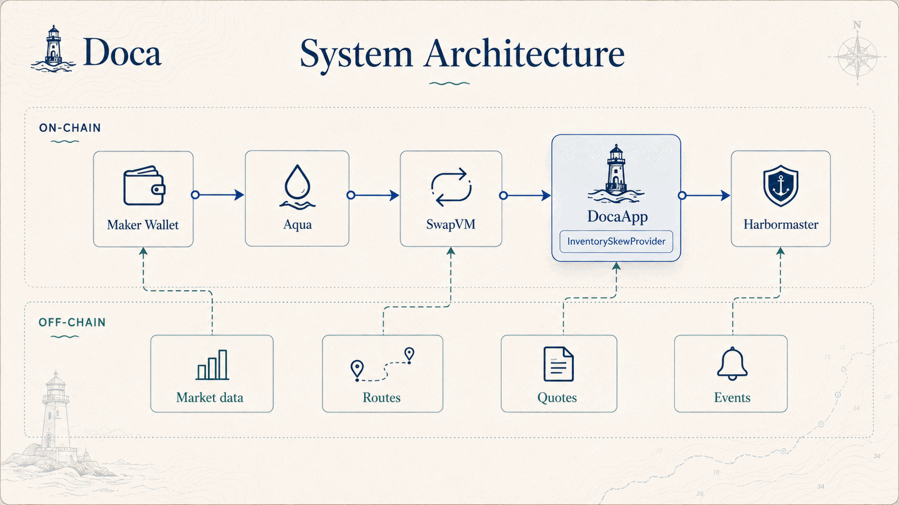
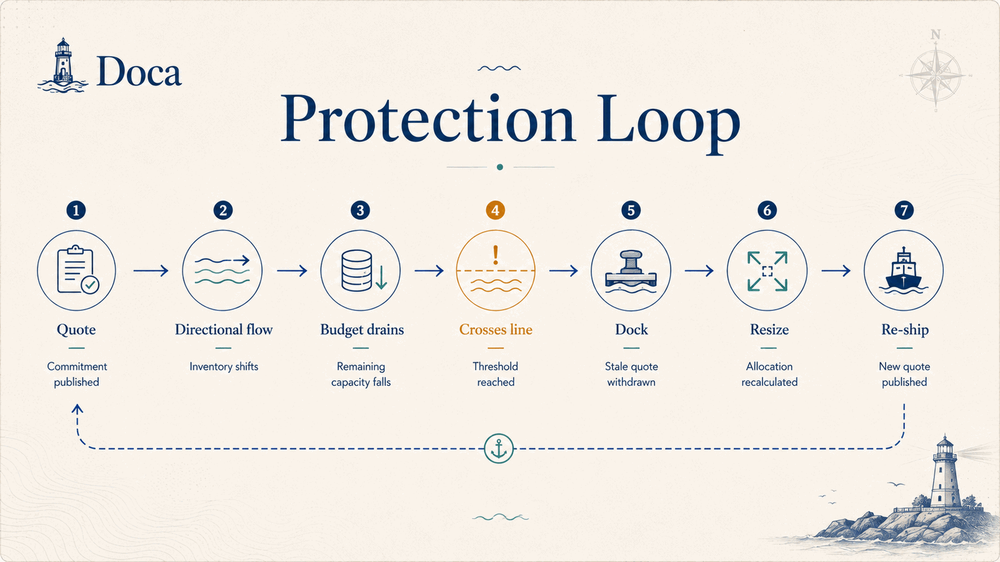

# Doca

**Keep your wallet. Put it to work anyway.**

A budget layer for [1inch Aqua](https://1inch.com/aqua). Aqua lets one wallet back several trading
strategies at once by shipping promises instead of deposits, and a promise can exceed what you
actually hold — by design. Doca adds the missing check: every strategy carries a budget that cannot
exceed your real balance, and the Harbormaster docks and re-ships when the balance moves.

Built at ETHGlobal Lisbon 2026.

**[Landing](https://doca-finance.pages.dev)** ·
[App](https://doca-finance.pages.dev/app/) ·
[Deck](https://doca-finance.pages.dev/deck/) ·
[Design dossier](https://doca-finance.pages.dev/dossier/) ·
[Agent surface](https://doca-finance.pages.dev/agents/) ·
[Brand](https://doca-finance.pages.dev/brand/)

## Contents

- [The gap](#the-gap)
- [The design](#the-design)
- [Ours and 1inch's](#ours-and-1inchs)
- [Live market reference — Uniswap API](#live-market-reference--uniswap-api)
- [Measurements](#measurements)
- [Run it](#run-it)
- [Tests](#tests)
- [Prior art](#prior-art)
- [Repo map](#repo-map)

---

## The gap

Aqua is a shared-liquidity settlement layer. A maker deposits nothing: they approve Aqua once, then
`ship` a promise — a record saying "this strategy may sell up to this much of my wallet, under these
price rules". Tokens move only during a fill, straight out of the maker's wallet. `dock` cancels the
promise. Nothing is ever custodied.

That is where the capital efficiency comes from, and it opens a failure mode nobody was handling.
`Aqua.ship` writes the promise **without checking balance or allowance**
([`Aqua.sol:40-52`](https://github.com/1inch/aqua)), so promises can exceed what the maker holds.

When flow turns directional the wallet empties while every strategy's virtual book still advertises
inventory. Takers get quotes that revert, and the maker's next refill is arbitraged at a stale
price. The Aqua whitepaper names this in §3 and prescribes a manual fix:

> "While Aqua doesn't automatically pause illiquid positions, Makers are strongly recommended to
> manually dock strategies that become chronically underfunded to prevent accumulating unfavorable
> price exposure."

One week before this hackathon, a 1inch-commissioned Dune study put numbers on the adjacent gap:
85% of tracked concentrated liquidity — $1.6B of $1.84B analyzed — was underutilized in H1 2026,
and individually managed positions accounted for most of the attributed idle capital on Uniswap v3
([CoinDesk, 2026-07-18](https://www.coindesk.com/web3/2026/07/18/here-is-why-a-massive-usd1-6-billion-in-crypto-liquidity-is-sitting-idle-and-wasting-away)).
That study measures manual LP management on a different venue, not Doca's failure mode directly —
we cite it as evidence the underlying discipline (sizing a position to what you actually hold) is a
gap the market already recognizes.

<sub>[↑ Contents](#contents)</sub>

## The design

One invariant, two pieces.

**The invariant.** A *promise* may exceed your wallet — that is the point of Aqua. A *budget* may
not. Every strategy carries a budget of what it is allowed to consume, sized against what the
wallet really holds. Doca prices depletion on-chain as a budget drains and repairs allocations
off-chain before underfunding turns into persistent failed quotes.

<p align="center">
  
</p>

**On-chain — `InventorySkewProvider`.** An `IProtocolFeeProvider` plugged into SwapVM's stock
`AquaDynamicProtocolFeeAmountIn` instruction (opcode 30). The fee is flat while a budget is healthy
and rises quadratically as it drains. Three properties:

| Property | What it means |
|---|---|
| Directional | The fee reads the outgoing token only, so draining the scarce side costs progressively more while the direction that refills you stays at the base rate. Takers are paid, in price, to rebalance you. |
| De-leveraging | SwapVM pulls the surcharge from the maker's Aqua balance and forwards it to a recipient of the maker's choosing, so value leaves the shared pool exactly when oversubscription risk peaks. |
| No new inputs | It reads only `AQUA.rawBalances` — never the wallet balance or allowances — which is what the whitepaper says an app should price against. |

**Off-chain — the Harbormaster.** Watches every strategy a maker has shipped; when one goes under
its waterline it docks it and re-promises against the balances the wallet holds now — the
whitepaper's manual recommendation, automated.

<p align="center">
  
</p>

**Trust model.** Demo: a local demo signer lets the Harbormaster act autonomously on camera. Real
connected wallet: the same actions currently require your signature. Production: a scoped session
key or smart-account module would authorize only `dock`, `ship` and waterline updates, with token
limits, budget limits and expiry. MCP: read-only observability (see [`mcp/`](mcp/)), not the
transaction executor. It is a deterministic risk keeper, not an autonomous AI agent.

### The next layer: a BudgetGuard instruction

InventorySkewProvider prices cumulative depletion measured before a fill runs; it has no notion of
what the fill about to execute does to the budget it consumes. The single-large-fill test in
[`contracts/test/adversarial.test.ts`](contracts/test/adversarial.test.ts) documents the
consequence directly: one trade sized past the waterline settles at the pre-fill base rate, not the
max rate its own resulting state would justify. Closing that gap is a separate SwapVM instruction,
not a change to the pricing curve described above, and it does not exist yet.

```solidity
// Not built. Sketch of a SwapVM instruction that checks a fill against the budget it is about to
// consume, instead of only pricing depletion measured before the fill runs.
interface IBudgetGuard {
    enum OnBreach { Revert, CapOutput, PricePostTradeState }

    // consumedAfterFill = consumed-before-fill + amountOut
    // if consumedAfterFill > orderBudget, apply onBreach: revert, cap amountOut down to the
    // budget, or reprice using the post-trade remaining fraction instead of the pre-fill one.
    function checkFill(
        bytes32 orderHash,
        address maker,
        address tokenOut,
        uint256 amountOut,
        OnBreach onBreach
    ) external returns (uint256 allowedAmountOut, uint32 postTradeFeeBps);
}
```

A revert is the simplest option and the cheapest one gas-wise. A capped output changes the amount
the taker actually receives mid-instruction, which SwapVM's current pipeline is not set up to do
after a fee opcode has already run. Pricing the post-trade state is the closest match to what the
single-large-fill test shows missing, but it needs the fee to be computed after the curve runs
instead of before it, which is a reordering of the instruction pipeline, not a parameter change.

<sub>[↑ Contents](#contents)</sub>

## Ours and 1inch's

Everything that settles value is 1inch's own code; we add two contracts. All of it is deployed and
live on Base mainnet:

| Component | Address on Base | Whose |
|---|---|---|
| Aqua registry | [`0x4999…6d31`](https://basescan.org/address/0x499943e74fb0ce105688beee8ef2abec5d936d31) | 1inch — canonical, live |
| `AquaSwapVMRouter` | [`0xc717…B989`](https://basescan.org/address/0xc71750516D13702Fde5861623131961c1eB3B989) | 1inch code, unmodified, our deployment |
| `InventorySkewProvider` | [`0x768F…54D9`](https://basescan.org/address/0x768FDce0cD1b6237811CA50D7758698e7EDe54D9) | ours — 178 lines |
| `DocaApp` | [`0x8A15…9694`](https://basescan.org/address/0x8A151aF27a0Ae421A2222ed9b6c58cd8AC179694) | ours — 93 lines, builds the SwapVM program |
| `AquaAMM` | [`0x400a…8234`](https://basescan.org/address/0x400a7692A205C426b0bD49a6e7A22c3D9DeC8234) | template code, our deployment |

Both of our contracts are source-verified with an exact bytecode match on Sourcify —
[`InventorySkewProvider`](https://repo.sourcify.dev/8453/0x768FDce0cD1b6237811CA50D7758698e7EDe54D9) ·
[`DocaApp`](https://repo.sourcify.dev/8453/0x8A151aF27a0Ae421A2222ed9b6c58cd8AC179694) — so the
source above is provably the code at those addresses.

Full addresses in [`web/src/deployment.base.json`](web/src/deployment.base.json). The demo runs on
a fork of the same chain, so what you see in the video executes against these exact contracts.

**Why our own router deployment.** The live routers (12 chains, June, `eip712Domain()` reports
`1.0.0`) predate the order-data layout the hackathon template targets. On July 24 1inch updated
`swap-vm-template` to pin `swap-vm#b44977a1` (release-1.2), which prefixes order data with the
40-byte token pair and adds taker flags, so orders built with the current template revert against
the June router by design. The template's own deploy flow ships a fresh router; we do the same and
wire it to the canonical live Aqua registry, which the bounty permits. Our extension point is
untouched by the skew: opcode 30 is `_aquaDynamicProtocolFeeAmountInXD` in both revisions.

<sub>[↑ Contents](#contents)</sub>

## Live market reference — Uniswap API

The practice fork is frozen at a pinned block; the real market is not. Doca uses the
**Uniswap Trading API** as its live Base mainnet reference so nothing the user sees is
priced in a vacuum:

- [`web/src/lib/uniswap-price.ts`](web/src/lib/uniswap-price.ts) — the client:
  `POST /v1/quote` (EXACT_INPUT WETH→USDC, chain 8453, V3+V4). Handles both CLASSIC and
  X response shapes.
- [`web/src/App.tsx`](web/src/App.tsx) — the Harbormaster annotates every dock/re-ship
  decision with the live price (`markRef`), and the header pill shows the current
  Uniswap quote next to the fork state.
- [`web/src/LpDesk.tsx`](web/src/LpDesk.tsx) +
  [`web/src/lib/pnl.ts`](web/src/lib/pnl.ts) — positions are valued mark-to-market
  against the quote; the PnL chart and history ticks are denominated in it.
- [`web/plugins/lp-desk-dev.ts`](web/plugins/lp-desk-dev.ts) — dev proxy that injects
  `x-api-key` server-side (the key never reaches the browser bundle) and polls spot
  for position history.

Developer feedback for the Uniswap team lives in [`FEEDBACK.md`](FEEDBACK.md).

<sub>[↑ Contents](#contents)</sub>

## Measurements

Paired control: two strategies shipped from the same wallet, same curve, same liquidity, same taker
flow, one instruction of difference. Every number below reproduces from a script in this repo.

**`contracts/scripts/waterline-scenario.ts`** — 30 fills into a 100/100 strategy, curve capped at 50%:

| | plain | with the skew |
|---|---:|---:|
| Inventory left | 6.25 (6.3%) | **8.08 (8.1%)** |
| Realized price for the LP | 16.0000 | **16.3187** |
| Pulled out of the shared pool | 0 | 362.54 |

29% more inventory standing, 1.99% better realized price on the drained leg. The 362 is
de-leveraging, not profit: it moves from committed liquidity to free balance, and the maker owns
both sides.

**`contracts/scripts/amplification-experiment.ts`** — trending market, price-sensitive ordinary
flow, and an arbitrageur that only trades when a quote is stale. Same market at 1x, 2x and 4x
amplification, with and without management:

| N | arm | flow fills | **unhonored fills** | LP end value | vs holding |
|---:|---|---:|---:|---:|---:|
| 1 | unmanaged | 12 | 0 | 283.11 | -5.63% |
| 1 | managed | 12 | 0 | 283.11 | -5.63% |
| 2 | unmanaged | 24 | 0 | 266.22 | -11.26% |
| 2 | managed | 24 | 0 | 266.22 | -11.26% |
| 4 | unmanaged | 43 | **43** | 234.62 | -21.79% |
| 4 | managed | 40 | **0** | **241.05** | -19.65% |

1. **Unmanaged amplification publishes quotes it cannot honor.** At 4x, 43 of 86 attempted fills
   reverted: the wallet was empty while every strategy still advertised inventory. With budgets:
   zero. That is binary, and it is the aggregator's problem as much as the maker's.
2. **Amplification multiplies impermanent loss close to linearly** — -5.6%, -11.3%, -21.8% versus
   holding at 1x, 2x, 4x. Each strategy sells the same real inventory into the same move.
3. **Management recovers 2.74%** of maker value at 4x, costing 3 of 43 fills of volume, because a
   taker who wanted to buy cheap walks away.

At 1x and 2x the mechanism does nothing, which is correct: budgets are never exhausted, so it costs
nothing when it is not needed.

<sub>[↑ Contents](#contents)</sub>

## Run it

Everything runs against a fork of Base, where the canonical Aqua is live and WETH and USDC are the
real token contracts. No funds are spent.

```bash
# 1. a node forking Base at a pinned block
anvil --fork-url https://mainnet.base.org --fork-block-number 49093600 --chain-id 8453

# 2. contracts: install, compile, test
cd contracts && yarn && npx hardhat test

# 3. deploy our side and seed the demo wallet
npx hardhat run scripts/deploy-for-web.ts --network localhost

# 4. the app
cd ../web && bun install && bun run dev     # http://127.0.0.1:5273

# the same flow, headless
bun run scripts/smoke.ts
```

The hosted app at [`/app/`](https://doca-finance.pages.dev/app/) reads the same fork, so it needs a
node in reach; without one it says so instead of rendering empty state.

**With your own wallet.** If an injected wallet is present, a **Connect wallet** button appears and
your account becomes the maker: every `ship`, `dock` and waterline change is signed by it. On the
fork, one-click seeding (WETH + USDC + approvals) lets any empty account run the whole journey. The
demo signer stays the default when no wallet is installed, so the recorded flow is reproducible.

Other scripts: `demo-flow-base.ts` (the whole loop against the canonical registry),
`waterline-scenario.ts` and `amplification-experiment.ts` (the measurements above).

<sub>[↑ Contents](#contents)</sub>

## Tests

`npx hardhat test` runs 11, four of them the official template's own:

- a healthy budget quotes the base fee, so ordinary flow is untouched
- the surcharge ramps quadratically past the kink and caps at the waterline, asserted against the
  closed form rather than a magic number
- the fee is directional: taking the scarce leg is surcharged, refilling it is not
- identical taker flow through a skewed and a plain program, shipped from the same wallet, leaves
  strictly more inventory standing in the skewed one, and the exact surcharge lands outside the
  pool — asserted with real ERC-20 balance changes

Three more, in [`contracts/test/adversarial.test.ts`](contracts/test/adversarial.test.ts), document
what InventorySkewProvider does and does not catch:

- a single fill that crosses the waterline in one shot settles at the pre-fill base rate, not the
  post-trade max rate its own resulting state would justify
- an external wallet transfer, made outside Aqua entirely, leaves the fee curve quoting the base
  rate against a wallet it can no longer see accurately; the fill only fails once the ERC20
  transfer underneath `Aqua.pull()` runs out of real balance to move
- two strategies shipped against the same wallet price independently, so one strategy's own budget
  can look nearly untouched while the wallet backing it has already been drained by the other

<sub>[↑ Contents](#contents)</sub>

## Prior art

**RiverSwap** (1st, ETHGlobal New York 2026) uses the same extension point, an
`IProtocolFeeProvider` on opcode 30, with an auction deciding the fee: whoever wins an epoch pays
rent and sets `feeBps`. Same slot, opposite input — theirs is an auction winner, ours is how much
budget is left. Theirs is market design, ours is balance-sheet risk.

**`progressiveFeeIn`** (opcode 37, `FeeExperimental.sol`) already makes draining a reserve cost
more, via `dx_eff = dx / (1 + λ·dx/x)` on `balanceIn`. It prices *trade size* against the inbound
reserve, so a thousand small fills drain you without it noticing, and it is not wired into
`AquaOpcodes`, so it is unreachable from the Aqua-backed router. We price *cumulative consumption*
against a budget. The two compose rather than compete.

<sub>[↑ Contents](#contents)</sub>

## Repo map

| Path | What |
|---|---|
| `contracts/` | `InventorySkewProvider.sol`, `DocaApp.sol`, tests, measurement scripts |
| `web/` | the app — `src/lib/doca.ts` is every chain call the UI makes |
| `mcp/` | read-only MCP server (`bun mcp/server.ts`): wallet, positions, health |
| `landing/`, `deck/`, `docs/` | landing page, pitch deck, design dossier and agent docs |
| `site/` | static site assembly and deploy (`bun site/build.mjs`, `site/deploy.sh`) |

Deeper documentation: [`DEV.md`](DEV.md) (working on it), [`DESIGN.md`](DESIGN.md) (the visual
system), [`BRAND.md`](BRAND.md) (tokens, voice, marks).

<sub>[↑ Contents](#contents)</sub>
